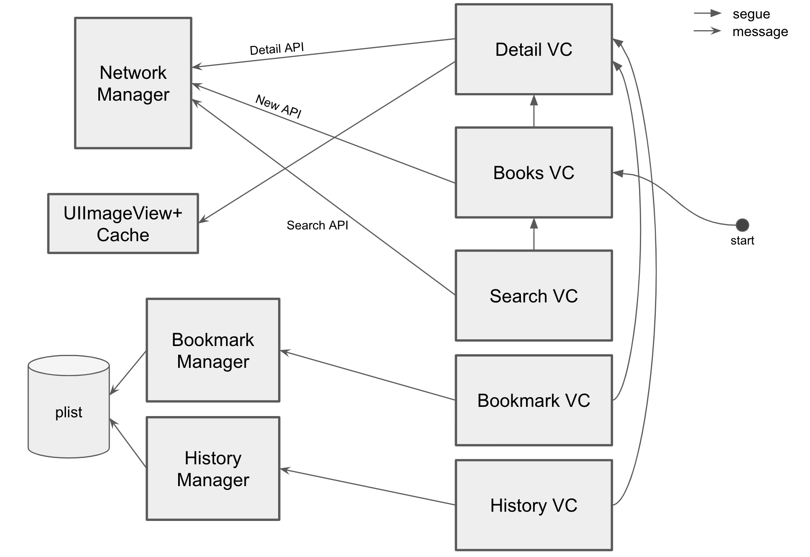

# Library Management
The assignment is to see code design, code accuracy, data structure, algorithms, and learning abilities, as well as the ability to implement your app.

## Components

## TODO
### Common
- ~~Network layer(`BookStoreClient`) for requesting Book API~~
- ~~Image loader (and cacher)~~
- ~~Issue manager (`NSUserDefaults`)~~
- ~~History manager (`NSUserDefaults`)~~

### New Scene
- ~~Request `New API`~~
- ~~Show new book list from the result of `New API`~~

### Detail Scene
- ~~Request `Detail Book API`~~
- ~~Show the detail book information from the result of `Detail Book API`~~
- ~~Issue the book (Undo issue the book)~~

### Search Scene
- ~~Request `Search API`~~
- ~~Show the book list from the result of `Search API`~~
- Auto load the next page

### Issue Scene
- ~~Show the book list from issue manager~~
- Edit the list (remove)
- Sort the list (title, price, authors etc)

### History Scene
- ~~Show the book list from history manager~~
